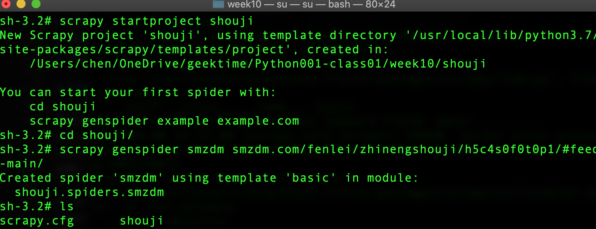

学习笔记
# 评分标准：（实现相应功能，每项 +10 分，部分实现 +5 分）
* 正确使用 Scrapy 框架获取评论，如果评论有多页，需实现自动翻页功能。
* 评论内容能够正确存储到 MySQL 数据库中，不因表结构不合理出现数据截断情况。
* 数据清洗后，再次存储的数据不应出现缺失值。
* Django 能够正确运行，并展示采集到的数据，数据不应该有乱码、缺失等问题。
* 在 Django 上采用图表方式展示数据分类情况。
* 舆情分析的结果存入到 MySQL 数据库中。
* 在 Django 上采用图表方式展示舆情分析的结果。
* 可以在 Web 界面根据关键字或关键词进行搜索，并能够在页面展示正确的搜索结果。
* 支持按照时间（录入时间或评论时间）进行搜索，并能够在页面展示正确的搜索结果。
* 符合 PEP8 代码规范，函数、模块之间的调用高内聚低耦合，具有良好的扩展性和可读性。
* 正确使用 Scrapy 框架获取评论，如果评论有多页，需实现自动翻页功能。

# 创建scrapy
```scrapy startproject shouji```
生成什么值得买爬取程序```scrapy genspider smzdm smzdm.com/fenlei/zhinengshouji/h5c4s0f0t0p1/#feed-main/```
smzdm.py
如图
```
# -*- coding: utf-8 -*-
import scrapy


class SmzdmSpider(scrapy.Spider):
    name = 'smzdm'
    allowed_domains = ['smzdm.com/fenlei/zhinengshouji/h5c4s0f0t0p1/#feed-main/']
    start_urls = ['http://smzdm.com/fenlei/zhinengshouji/h5c4s0f0t0p1/#feed-main//']

    def parse(self, response):
        pass
```

## 修改scrapy 中的settings.py 配置文件
```python
from fake_useragent import UserAgent
ua = UserAgent()
USER_AGENT = ua.random
DOWNLOAD_DELAY = 2
SPIDER_MIDDLEWARES = {
   'shouji.middlewares.ShoujiSpiderMiddleware': 543,
}
ITEM_PIPELINES = {
   'shouji.pipelines.ShoujiPipeline': 300,
}
```
# 编写settings.py中的配置文件
```python
from fake_useragent import UserAgent
ua = UserAgent()
USER_AGENT = ua.google

DOWNLOAD_DELAY = 2

DOWNLOADER_MIDDLEWARES = {
   'shouji.middlewares.ShoujiDownloaderMiddleware': 543,
}
SPIDER_MIDDLEWARES = {
   'shouji.middlewares.ShoujiSpiderMiddleware': 543,
}
ITEM_PIPELINES = {
   'shouji.pipelines.ShoujiPipeline': 300,
}
```
# 定义提取的Item coding Item.py

```python
# -*- coding: utf-8 -*-

# Define here the models for your scraped items
#
# See documentation in:
# https://docs.scrapy.org/en/latest/topics/items.html

import scrapy


class ShoujiItem(scrapy.Item):
    # define the fields for your item here like:
    # name = scrapy.Field()
    date = scrapy.Field()
    n_star = scrapy.Field()
    estimate = scrapy.Field()
    sentiment = scrapy.Field()
```
# 编写爬取网站的 spider,spider/smzdm.py 

如图


```python
# -*- coding: utf-8 -*-
import scrapy
import pandas as pd
from snownlp import SnowNLP
from shouji.items import ShoujiItem
from scrapy.selector import Selector


class SmzdmSpider(scrapy.Spider):
    name = 'smzdm'
    allowed_domains = ['smzdm.com/fenlei/zhinengshouji/h5c4s0f0t0p1/#feed-main/']
    start_urls = ['http://smzdm.com/fenlei/zhinengshouji/h5c4s0f0t0p1/#feed-main//']

    # def parse(self, response):
    #     pass
    def start_requests(self):
        for i in range(1,2):
            url = f'https://www.smzdm.com/fenlei/zhinengshouji/h5c4s0f0t0p{i}/#feed-main/'
            yield scrapy.Request(url = url, callback = self.parse, dont_filter=True)
    def parse(self, response):
        item = ShoujiItem()
        link = Selector(response=response).xpath('//ul[@id="feed-main-list"]/li/div/div[1]/a/@href').extract()
        for i in range(0,len(link)):
            yield scrapy.Request(url=link[i], meta={'item': item}, callback=self.parse2, dont_filter=True)
    def parse2(self, response):
        item = response.meta['item']
        link = Selector(response=response).xpath('//div[@id="commentTabBlockNew"]/ul[2]/li/a/@href').extract()
        if len(link) == 0:
            dates = Selector(response=response).xpath('//li[@class="comment_list"]/div[2]/div[1]/div[1]/meta/@content').extract()
            for i in range(1,len(dates)+1):
                date = Selector(response=response).xpath(f'//li[@class="comment_list"][{i}]/div[2]/div[1]/div[1]/meta/@content').extract_first()
                if len(date) == 0:continue
                estimates = pd.Series(Selector(response=response).xpath('//span[@itemprop="description"]/text()').extract())
                def _sentiment(text):
                    return SnowNLP(text).sentiments
                for j in range(0,len(estimates)):
                    estimate = estimates[j].strip()
                    if len(estimate) == 0:continue
                    sentiment = _sentiment(estimate)
                    if sentiment < 0.4:continue
                    n_star = sentiment // 0.2 + 1
                    item['date'] = date
                    item['n_star'] = n_star
                    item['estimate'] = estimate
                    item['sentiment'] = sentiment
                    yield item
        else:
            for i in range(0,len(link)-2):
                yield scrapy.Request(url =link[i], meta={'item':item}, callback = self.parse3, dont_filter=True)
    def parse3(self, response):
        item = response.meta['item']
        dates = Selector(response=response).xpath('//li[@class="comment_list"]/div[2]/div[1]/div[1]/meta/@content').extract()
        for i in range(1,len(dates)+1):
            date = Selector(response=response).xpath(f'//li[@class="comment_list"][{i}]/div[2]/div[1]/div[1]/meta/@content').extract_first()
            if len(date) == 0:continue
            estimates = pd.Series(Selector(response=response).xpath('//span[@itemprop="description"]/text()').extract())
            def _sentiment(text):
                return SnowNLP(text).sentiments
            for j in range(0,len(estimates)):
                estimate = estimates[j].strip()
                if len(estimate) == 0:continue
                sentiment = _sentiment(estimate)
                if sentiment < 0.4:continue
                n_star = sentiment // 0.2 + 1
                item['date'] = date
                item['n_star'] = n_star
                item['estimate'] = estimate
                item['sentiment'] = sentiment
                yield item
```
# 编写 item pipeline 将item存储到数据库中,pipelines.py
```python
import pymysql
from itemadapter import ItemAdapter
class ShoujiPipeline:
    def process_item(self, item, spider):
        conn = pymysql.connect(host = '127.0.0.1',
                        port = 3306,
                        user = 'root',
                        password = '',
                        database = 'django',
                        charset = 'utf8mb4'
                        )
        sql = 'DROP TABLE shouji_shouji;'
        sql1 = ''' CREATE TABLE IF NOT EXISTS `shouji_shouji`(
                `id` INT UNSIGNED AUTO_INCREMENT,
                `date` varchar(30) not null,
                `n_star` int(5) not null,
                `estimate` varchar(200) NOT NULL,
                `sentiment` decimal(11,10) not null,
                PRIMARY KEY ( `id` )
                )ENGINE=InnoDB DEFAULT CHARSET=utf8mb4;'''
        sql2 = "INSERT INTO `shouji_shouji`(`date`, `n_star`, `estimate`, `sentiment`) VALUES ('{date}','{n_star}', '{estimate}', '{sentiment}')".format(date=item['date'], n_star=item['n_star'], estimate=item['estimate'], sentiment=item['sentiment'])
        
        try:
            # 获得cursor游标对象
            con1 = conn.cursor()
            # 操作的行数
            con1.execute(sql)
            con1.execute(sql1)
            con1.execute(sql2)
            conn.commit()
        except Exception as e:
            print(sql1)
            print(e,f'\n{"*"*20}操作失败{"*"*20}')
        con1.close()
        conn.close()
        return item
```


# 创建并编写定时脚本 crontab.py
```python
from apscheduler.schedulers.blocking import BlockingScheduler
from datetime import datetime
import os

# 输出时间
def job():
    print(datetime.now().strftime("%Y-%m-%d %H:%M:%S"))    
    os.system('cd ./week10/shouji/shouji & scrapy crawl smzdm')
# BlockingScheduler
scheduler = BlockingScheduler()
scheduler.add_job(job, 'cron', day_of_week='0-6', hour=17, minute=48)
scheduler.start()
```
# 创建Django 项目 
```django-admin startproject MyDjango```
## 配置 MyDjango settings.py
```python
INSTALLED_APPS = [
    'django.contrib.admin',
    'django.contrib.auth',
    'django.contrib.contenttypes',
    'django.contrib.sessions',
    'django.contrib.messages',
    'django.contrib.staticfiles',
    'shouji',
]
DATABASES = {
    'default': {
        'ENGINE': 'django.db.backends.mysql',
        'NAME': 'django',
        'USER': 'root',
        'PASSWORD': '',
        'HOST': '127.0.0.1',
        'POST': '3306',
    }
}
```
## 配置MyDjango urls.py调度器
```python
from django.contrib import admin
from django.urls import path,include

urlpatterns = [
    path('admin/', admin.site.urls),
    path('',include('shouji.urls'))
]
```
# 创建Django 应该
``` python3 manage.py  startapp shouji ```
